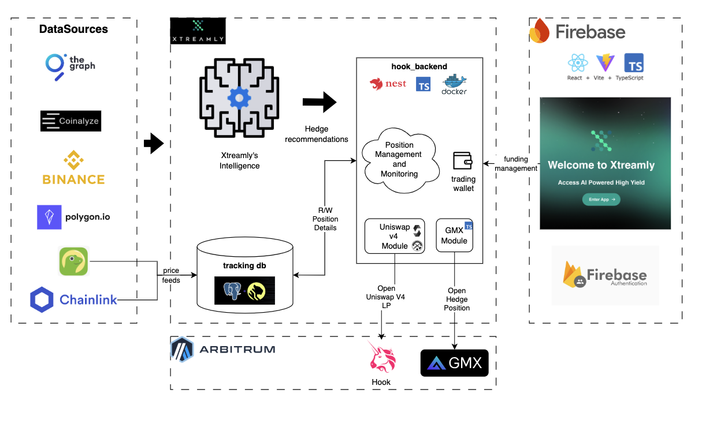

# Xtreamly Hook: Delta-Neutral Liquidity Management for Uniswap v4

A sophisticated liquidity management system that leverages Uniswap v4's hook architecture to create delta-neutral positions via intelligent hedging strategies.

## Overview

Xtreamly Hook represents a paradigm shift in liquidity provision for decentralized exchanges. By intercepting key liquidity events through Uniswap v4's hook architecture and connecting them with hedging venues like GMX, Opyn (TBD) the system creates delta-neutral strategies that maximize fee generation while protecting against impermanent loss.

The platform enables users to deposit into custom-designed hooks that continuously monitor position exposure and automatically hedge on GMX, creating sophisticated risk-managed positions previously available only to professional market makers.

## Project Progress

- **Backend Infrastructure**: Built a robust NestJS backend with TimescaleDB integration, enabling high-performance time-series data processing for position tracking and analysis.

- **Position Management**: Implemented comprehensive position tracking with real-time monitoring capabilities and historical performance analysis.

- **Price Oracle Integration**: Integrated a price feed system using CoinGecko API with fallback mechanisms to ensure continuous operation, with plans to include Chainlink Oracle Feeds.

- **Hedging Logic**: Created sophisticated hedging algorithms that dynamically adjust GMX positions based on Uniswap v4 exposure.
https://xtreamly.io/api

- **GMX Hedging Strategy**: Developed a balanced hedging approach using GMX perpetual futures to offset Uniswap v4 position risk, with careful consideration of funding rates and trading costs. [View detailed strategy](docs/perpHedgeStrat.pdf)


- **User Management**: Established secure wallet authentication and position ownership verification to protect user assets.

- **Performance Analytics**: Built advanced analytics tools for tracking position performance, hedging efficiency, and fee generation.

## System Architecture

<p align="center">
  
</p>

Our architecture is structured around three core components:

1. **Data Sources Layer**: Integrates with critical DeFi data sources including The Graph, Coinalyze, Binance, Polygon.io, and Chainlink to provide comprehensive market data.

2. **Core Intelligence Layer**: Processes market data through our proprietary analytics engine to determine optimal position management strategies.

3. **Execution Layer**: Interfaces with Uniswap v4 hooks and GMX positions to execute the delta-neutral strategies.

### Technology Stack

#### Frontend (WIP)

#### AI (WIP)

#### Backend (WIP)

- **Backend**: NestJS with TypeScript for a robust, type-safe application framework
- **Database**: PostgreSQL with TimescaleDB extension for high-performance time-series data
- **ORM**: TypeORM for type-safe database interactions
- **Blockchain Integration**: Custom Uniswap V4 Hook implementation, Chainlink Price Feeds
- **Hedging Integration**: Specialized GMX position management service

## Impact and Innovation

Xtreamly Hook delivers several key innovations in the DeFi liquidity space:

- **Real-time Risk Neutralization**: Unlike existing solutions that require manual intervention, our hooks automatically detect and hedge position drift as market conditions change.

- **Capital Efficiency**: By dramatically reducing impermanent loss risk, capital can be deployed more aggressively into narrower price ranges, potentially increasing fee generation by 2-5x compared to unhedged positions.

- **Composable Architecture**: Our modular design allows for integration with multiple hedging venues beyond GMX, creating resilience against venue-specific risks.

- **Democratized Access**: Sophisticated trading strategies previously available only to professional market makers are now accessible to retail LPs through a simple deposit interface.

The market impact could be substantial. Currently, over $2 billion in liquidity sits in Uniswap v3 pools, much of it inefficiently deployed due to impermanent loss concerns. By addressing this fundamental risk, our solution could unlock deeper liquidity, tighter spreads, and better capital efficiency across the DeFi ecosystem.

For individual LPs, our initial testing suggests potential yield improvements of 30-50% compared to unhedged strategies, with dramatically reduced volatility in returns.

## Features

- User registration with wallet-based authentication
- Comprehensive position management interface
- Automated hedging on GMX
- Integration with our custom Uniswap V4 hooks
- Time-series data storage for position history
- Advanced analytics for position performance

## Prerequisites

- Node.js LTS (v22.x /lts/jod)
- Docker and Docker Compose
- PNPM (for package management)

## Setup

1. **Clone the repository**

```bash
git clone git@github.com:Xtreamly-Team/xtreamly-hook.git
cd hook_backend
```

2. **Install dependencies**

```bash
pnpm install
```

3. **Create .env file**

Copy the example `.env` file and adjust as needed:

```bash
cp .env.example .env
```

4. **Start the database**

```bash
docker-compose up -d xtr_trade_db
```

5. **Run migrations**

```bash
pnpm run migration:run
```

6. **Start the application**

```bash
pnpm run start:dev
```

The application will be available at http://localhost:3000

## Development

### Generate a migration

```bash
pnpm run migration:generate src/modules/database/migrations/MigrationName
```

### Create a new migration

```bash
pnpm run migration:create src/modules/database/migrations/MigrationName
```

### Run migrations

```bash
pnpm run migration:run
```

### Revert the last migration

```bash
pnpm run migration:revert
```

## API Endpoints

### User Management

- `POST /users/register` - Register a new user
- `GET /users/:walletAddress` - Get user by wallet address

### Position Management

- `POST /positions/quote` - Get a quote for opening a position
- `POST /positions` - Open a new position
- `GET /positions/user/:userId` - Get positions for a user
- `GET /positions/:id` - Get position details
- `GET /positions/:id/history` - Get position history
- `PATCH /positions/:id/status` - Update position status

## Database Schema

### Users Table

- `id` - UUID primary key
- `walletAddress` - User's blockchain wallet address
- `email` - Optional email address
- `isActive` - User account status
- `createdAt` - Creation timestamp
- `updatedAt` - Last update timestamp

### Positions Table

- `id` - UUID primary key
- `userId` - Foreign key to users table
- `tokenA` - First token address
- `tokenB` - Second token address
- `amountA` - Amount of first token
- `amountB` - Amount of second token
- `lowerTick` - Lower tick price bound
- `upperTick` - Upper tick price bound
- `hedgeAmount` - Amount hedged on GMX
- `status` - Position status (pending/active/rebalancing/closed)
- `uniswapPositionId` - Uniswap position identifier
- `gmxPositionId` - GMX position identifier
- `metadata` - Additional position metadata
- `createdAt` - Creation timestamp
- `updatedAt` - Last update timestamp

### Position History Table (TimescaleDB hypertable)

- `id` - UUID primary key
- `positionId` - Foreign key to positions table
- `tokenAValue` - Value of token A at this point in time
- `tokenBValue` - Value of token B at this point in time
- `hedgeValue` - Value of the hedge position
- `netValue` - Net position value
- `metadata` - Additional historical metadata
- `timestamp` - Time of the history record (TimescaleDB partition column)

## Notable Challenges and Potential Blockers

### Current Challenges

1. **Cross-chain Synchronization**: Ensuring atomic execution of position updates across Uniswap v4 and GMX presents significant technical challenges, especially when operating across different chains.

2. **Price Oracle Reliability**: While we've implemented redundancy with multiple price feeds, momentary discrepancies between oracles can still lead to suboptimal hedging decisions.

3. **Gas Efficiency**: The constant position monitoring and adjustment process requires careful optimization to ensure gas costs don't erode yield advantages.

4. **Rebalancing Timing**: Determining the optimal threshold and timing for rebalancing operations involves complex trade-offs between hedging precision and transaction costs.

5. **Liquidation Risk Management**: Maintaining optimal Loan-to-Value Ratios (LVR) across both Uniswap v4 positions and GMX hedges requires sophisticated monitoring and risk management systems.

6. **LVR Divergence**: Market volatility can cause the LVR of Uniswap positions and GMX hedges to diverge, potentially creating dangerous imbalances that need rapid mitigation.

7. **Collateral Optimization**: Balancing collateral requirements across multiple venues while maintaining sufficient liquidity for hedging operations presents complex capital efficiency challenges.

8. **Perp Liquidation Prevention**: Developing robust early warning systems and automated responses to prevent forced liquidations during high volatility periods.


## Next Steps

Our current development focus is on:

1. Refining the hedging algorithms to minimize slippage during rebalancing operations
2. Develop and deploy our uni v4 hook and setup Event listeners on our backend
3. Optimizing gas consumption in the hook implementation
4. Expanding the range of supported trading pairs
5. Enhancing the position monitoring analytics suite
6. Implementing advanced risk management features for extreme market conditions